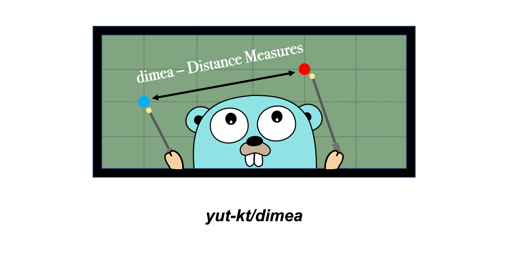

# dimea
**Calculate the distance support for Go language**



*Gopher image by [Renee French][rf], licensed under [Creative Commons 3.0 Attributions license][cc3-by].*

[](https://github.com/yut-kt/dimea/releases)
[](https://github.com/yut-kt/dimea/actions/workflows/default_branch_test.yaml)
[]()
[](https://goreportcard.com/report/github.com/yut-kt/dimea)  
[](https://pkg.go.dev/github.com/yut-kt/dimea)
[](https://raw.githubusercontent.com/yut-kt/dimea/main/LICENSE)


## Install
```bash
$ go get github.com/yut-kt/dimea
```

## Usage
See [dimea_example_test.go](https://github.com/yut-kt/dimea/blob/main/dimea_example_test.go) for detailed Usage

## License
dimea is released under the [MIT License](https://raw.githubusercontent.com/yut-kt/dimea/main/LICENSE).

[rf]: https://reneefrench.blogspot.com/
[cc3-by]: https://creativecommons.org/licenses/by/3.0/